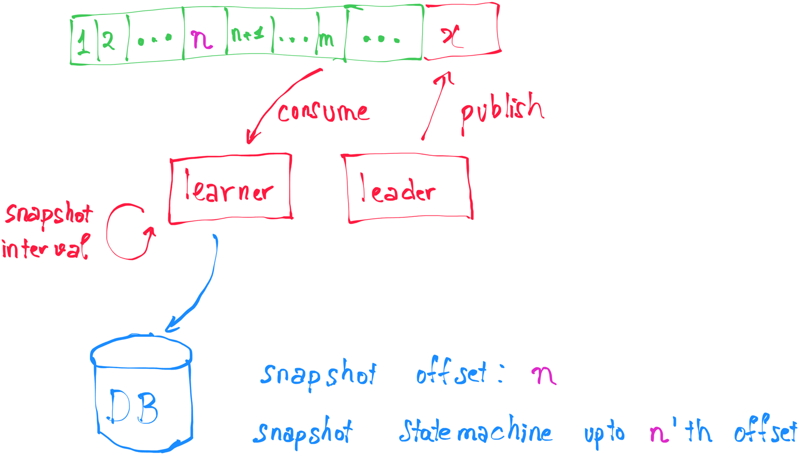
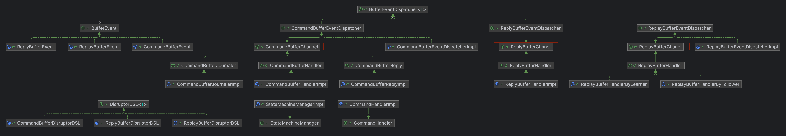

# BANK APP 

<div>
  
  
  
  
  
</div>


A simple high performance bank application using command sourcing.
- Process around `200,000` **write-requests** per second on a single `leader` node.

  Result of sending 500k write-requests (deposit only) to the `leader` with 64 grpc connections (running on a MacBook Pro, 13-inch, M1, 16 GB, 2020):

  

- By adding more the `follower` nodes, the `read` throughput can increase linearly, theoretically reaching `infinity`.

**NOTE:** This project is slated for significant performance enhancements through the implementation of `Cap'n Proto` serialization (serde) and `Cap'n Proto RPC`, or alternatively, technologies such as `RSocket`.
Benchmarking results will be updated accordingly to reflect these improvements in due course.

## Architecture
### High-level design


The architecture resembles that of [Lmax Architecture](https://martinfowler.com/articles/lmax.html#:~:text=Figure%204%3A%20The%20LMAX%20architecture%20with%20the%20disruptors%20expanded), but in a simplified form.
This is achieved by journaling `command logs` into Kafka and by omitting the use of the `replicator processor`.

- `cluster-app`:
  - `leader` node: handles all incoming commands, queries.
  - `follower` node: handles all incoming queries, replays command-logs published by `leader`.
  - `learner` node: replays command-logs published by `leader`, takes snapshot of state-machine.

- `client-app` interacts with `cluster-app` via `grpc` protocol, provides Restful Api. Including modules:
  - `admin`
  - `user`

#### Leader core flow
- All commands requested from client-apps are published into an inbound ring-buffer (command-buffer).
- The commands are then grouped into chunks and then streamed into disk (kafka - one partition) when disruptor's `EventHandler` reaches `endOfBatch`.
- The business-logic consumer then processes all incoming commands in order to build `state-machine`.
- Finally, the results are published into an out-bound ring-buffer (reply-buffer) in order to reply back to `client-apps`.

### How to snapshot the state-machine and replay the command logs ?

Before we dive in, let's go over a few preliminary notes:
- Only the `leader` node is responsible for writing the `command-log` into the into `command-log-storage`.
- Meanwhile, the `learner` node is exclusively tasked with snapshotting the state machine.



- Assume that the latest offset in kafka is `x` and the `learner` replays `command-log` up to m'th offset.
- The `learner` snapshots the `state-machine` interval or every `command-size`.
- Assume that the `learner` snapshots up to n'th offset.
  - For `optimization`, the `learner` snapshots only the `states` that have changed from the last-snapshot-offset to n'th offset.
- When the `cluster` (`leader`, `follower` or `learner`) restart, it first loads the `snapshot`, then replays the `command-log` from `n + 1`'th offset to rebuild state-machine.
  - If there is no `snapshot` stored in the `database`, then the `cluster` will replay all `command-log` from the beginning.

The snapshot trigger and logic can be found in `LearnerBootstrap -> startReplayMessage()` and `ReplayBufferHandlerByLearner`.

### Cluster structure

#### Cluster hexagonal architecture


- `cluster-core`: domain logic.
- `cluster-app`: framework & transport layer, implements `cluster-core`'s interface ports.

#### Cluster core structure


**Note**: All `producers`(or `dispatcher`) and `consumers`(or `processor`) interacting with the same `ring-buffer` are managed as children of a `buffer-channel`.

## Features
### Cluster core features
- [X] Journaling command logs.
- [X] Replaying command logs.
- [X] Managing state machine.
- [X] Replicating state machine.
- [X] Snapshotting state machine.
- [X] Processing domain logic.
  - [X] Create balance.
  - [X] Deposit money.
  - [X] Withdraw money.
  - [X] Transfer money.
  - [X] Get balance by id.
  - [ ] List all balances.

### Business features
- [ ] `Admin`:
  - [X] Create balance.
  - [X] Deposit money.
  - [X] Withdraw money.
  - [X] Transfer money.
  - [ ] List all balances.
  - [X] Get balance by id.

- [ ] `User`:
  - [ ] Get current balance.
  - [ ] Deposit money.
  - [ ] Withdraw money.
  - [ ] Transfer money.

## Project structure
- `cluster-core`: Domain logic.
- `cluster-app`: Implements `cluster-core` and provides transport-layer (ex: grpc), framework-layer.
- `client-core`: Provides `libs` to interacts with `cluster`, provides `request-reply` channel for incoming requests.
- `client`: Interacts with `cluster-app`, providers `api-resource`.

## Show helps
```shell
make help
```

## Development

- [X] Setup dev environment
```shell
make setup-dev
```

- [X] Start `leader` node - processing read and write requests
```shell
make run-leader
```

- [X] Start `follower` node - processing read requests
```shell
make run-follower
```

- [X] Start `learner` node - snapshotting state machine
```shell
make run-learner
```

- [X] Start `admin` app - CRUD app
```shell
make run-admin
```

- [ ] Start `user` app (Not available yet)
```shell
make run-user
```

## FAQ
### How to test grpc endpoint?
In order to test grpc server, you can use portman to send message like this


### How to benchmark grpc server?
We use `ghz`([link](https://github.com/bojand/ghz)) as a benchmarking and load testing tool.

```shell
ghz --insecure --proto ./bank-libs/bank-cluster-proto/src/main/proto/balance.proto \
--call gc.garcol.bank.proto.BalanceQueryService/sendQuery \
-d '{"singleBalanceQuery": {"id": 1,"correlationId": "random-uuid"}}' \
-c 200 -n 100000 \
127.0.0.1:9500
```

### How to benchmark client apps?
We use `autocannon` (it can produce more load than `wrk` and `wrk2`).

See [BENCHMARK](./README_benchmark.md) for more details.

## References
- [How Binance Ledger Powers Your Binance Experience](https://www.binance.com/en/blog/tech/how-binance-ledger-powers-your-binance-experience-5409682424466769892)
- [The LMAX Architecture](https://martinfowler.com/articles/lmax.html)
- [LMAX Disruptor: High performance alternative to bounded queues for exchanging data between concurrent threads](https://lmax-exchange.github.io/disruptor/disruptor.html)

## Archive
[Change logs](CHANGELOG.md):
- [v1.0.0](https://github.com/gc-garcol/lmax-disruptor-bank/tree/archive/v0.0.1)
