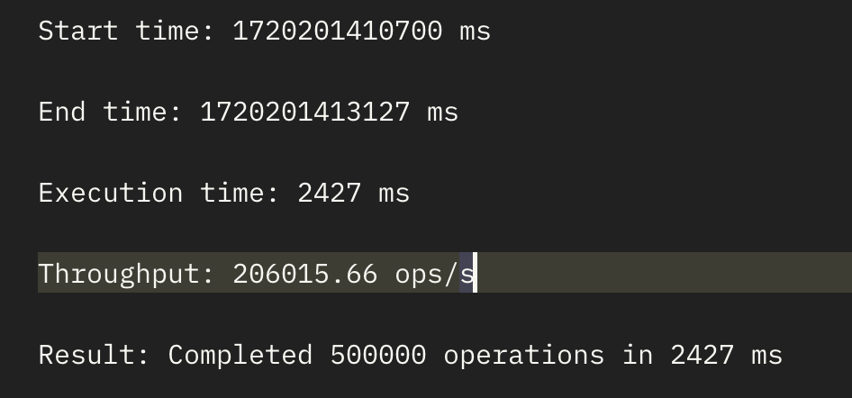

# BANK APP 

<div>
  
  
  
  
  
</div>


A simple high performance bank application using command sourcing.
- Process `50.000` **write-requests** per second on a single `leader` node.

  Result of sending 300k deposit-request to `leader` (running on a MacBook Pro 13-inch, M1, 2020):

  

- Linear scale out the `read` throughput by adding more `follower` nodes.

**NOTE:** This project is slated for significant performance enhancements through the implementation of `Cap'n Proto` serialization (serde) and `Cap'n Proto RPC`, or alternatively, technologies such as `RSocket`.
Benchmarking results will be updated accordingly to reflect these improvements in due course.
## Architecture
### High-level design


- `cluster-app`:
  - `leader` node: handles all incoming commands, queries.
  - `follower` node: handles all incoming queries, replays command-logs published by `leader`.
  - `learner` node: replays command-logs published by `leader`, takes snapshot of state-machine.

- `client-app` interacts with `cluster-app` via `grpc` protocol, provides Restful Api. Including modules:
  - `admin`
  - `user`

#### Leader core flow
- All commands requested from client-apps are published into a inbound ring-buffer (command-buffer).
- The commands are then streamed into disk (kafka - one partition) chunk by chunk.
- The business-logic consumer then process all incoming commands in order to build `state-machine`.
- Finally, the results are published into out-bound ringbuffer (reply-buffer) in order to reply back to `client-apps`.

### Cluster structure


- `cluster-core`: domain logic.
- `cluster-app`: framework & transport layer, implements `cluster-core`'s interface ports.

## Features
### Cluster core features
- [X] Journaling command logs.
- [X] Replaying command logs.
- [X] Managing state machine.
- [X] Snapshotting state machine.
- [X] Processing domain logic.
  - [X] Create balance.
  - [X] Deposit money.
  - [X] Withdraw money.
  - [X] Transfer money.
  - [X] Get balance by id.
  - [ ] List all balances.

### Business features
- [ ] `Admin`:
  - [X] Create balance.
  - [X] Deposit money.
  - [X] Withdraw money.
  - [X] Transfer money.
  - [ ] List all balances.
  - [ ] Get balance by id.

- [ ] `User`:
  - [ ] Get current balance.
  - [ ] Deposit money.
  - [ ] Withdraw money.
  - [ ] Transfer money.

## Project structure
- `cluster-core`: Domain logic.
- `cluster-app`: Implements `cluster-core` and provides transport-layer (ex: grpc), framework-layer.
- `client`: Interacts with `cluster-app`, providers `api-resource`.

## Show helps
```shell
make help
```

## Development

- [X] Setup dev environment
```shell
make setup-dev
```

- [X] Start `leader` node
```shell
make run-leader
```

- [ ] Start `follower` node (Not available yet)
```shell
make run-leader
```

- [X] Start `learner` node
```shell
make run-learner
```

- [X] Start `admin` app
```shell
make run-admin
```

- [ ] Start `user` app (Not available yet)
```shell
make run-user
```

## FAQ
### How to test grpc endpoint?
In order to test grpc server, you can use portman to send message like this


### How to benchmark grpc server?
We use `ghz`([link](https://github.com/bojand/ghz)) as a benchmarking and load testing tool.

```shell
ghz --insecure --proto ./bank-libs/bank-cluster-proto/src/main/proto/balance.proto \
--call gc.garcol.bank.proto.BalanceQueryService/sendQuery \
-d '{"balanceFilterQuery": {"id": 1,"correlationId": "random-uuid"}}' \
-c 200 -n 100000 \
127.0.0.1:9500
```

See [BENCHMARK](./README_benchmark.md) for more details.
